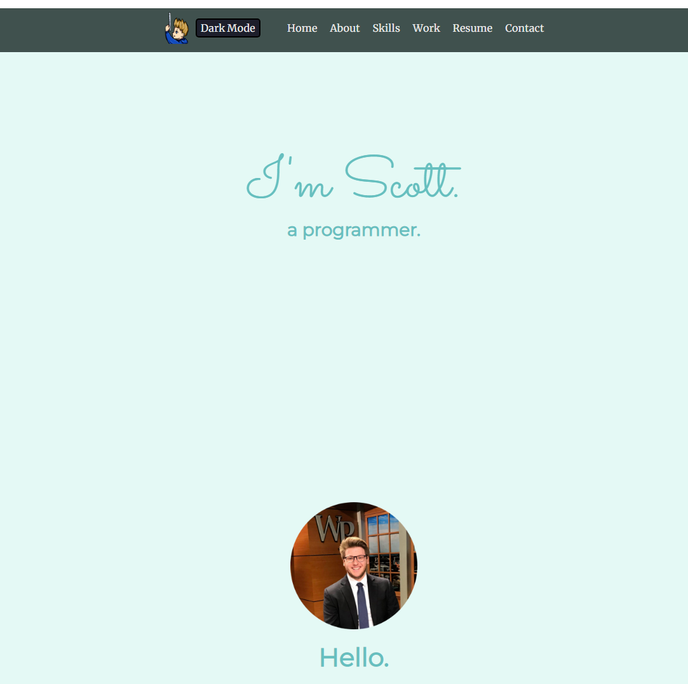

# portfolio

This is a portfolio created as my Unit 1 Project for my General Assembly Bootcamp. It is an all-in-one place to get information on who I am, the skills I know, work I've done, and ways to contact me. 

## [Here is the deployed website](https://ssemlitz-portfolio.netlify.app/)

## [Here is the trello page for the website](https://trello.com/b/YSISkbaP/scott-semlitz-portfolio)

## Technologies Used: 
- HTML
- CSS
- JavaScript
- git

## Credits
- Check out [Bootstrap](https://getbootstrap.com/)

## Next steps 
- Create button at bottom to scroll back to top
- Click icons in the skills section to get blurb about icons
- Create a carousel in the work sections
- Create changing animation for light/dark mode
- Create element that follows around cursor

